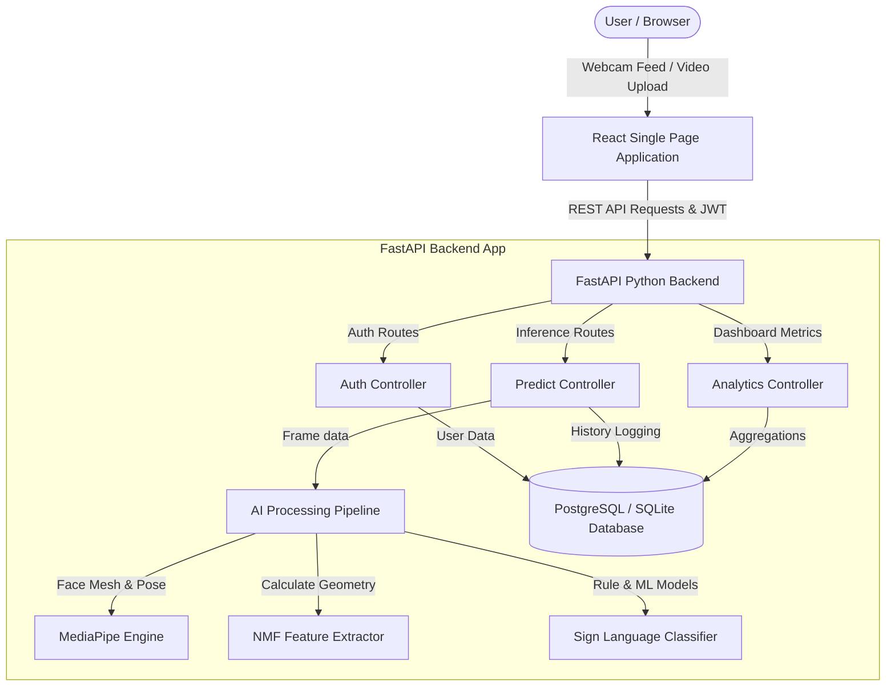
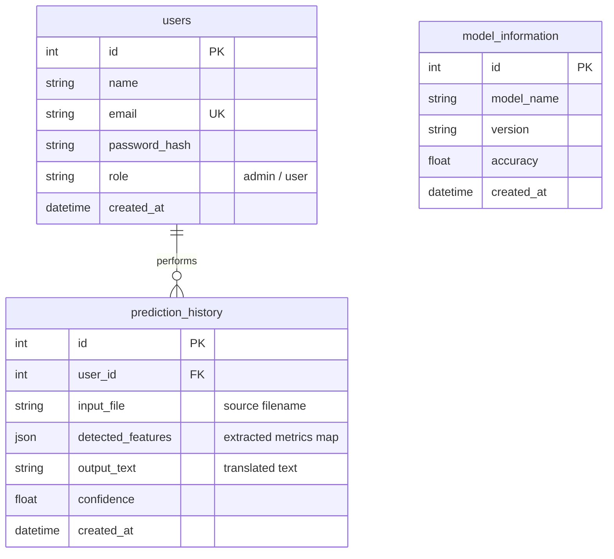
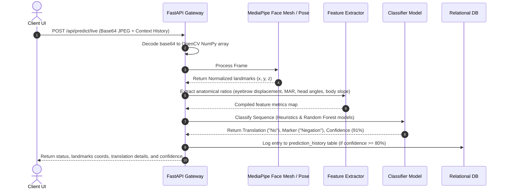

# Capturing Non-Manual Features of Indian Sign Language and Converting It into Text

An advanced, production-ready AI translation platform that captures, maps, and translates **Non-Manual Features (NMFs)** of Indian Sign Language (ISL)—such as facial expressions, eyebrow movements, eye gaze direction, head pose variations, and torso lean—into readable text translations. 

This platform consists of a modern **React & TypeScript SaaS Dashboard** frontend, a high-performance **Python FastAPI REST API** backend, a **PostgreSQL** relational database with automated SQLite fallback, and a state-of-the-art **Computer Vision & Landmark Extractor** pipeline built on OpenCV and MediaPipe.

---

## 🏗️ System Architecture

The platform uses a decoupled three-tier architecture:
1. **SaaS Dashboard (React.js + TS + Vite)**: Communicates with backend endpoints, loops webcam frames (at 3Hz to conserve bandwidth), overlays face landmark coordinates dynamically on the canvas, and displays analytics.
2. **Backend API (FastAPI)**: Formulated on clean architecture patterns (Controller-Service-Repository). Orchestrates database connections, performs JWT token validation, and initiates ML pipeline actions.
3. **AI/ML Subsystem (MediaPipe & OpenCV)**: Decodes video frames, isolates facial geometries via 478 Face Mesh markers and body tilt angles via Pose tracking, calculates normalized physiological metrics, and translates them into sign language grammatical expressions.



---

## 🗄️ Database ER Diagram

The relational layout tracks user sessions, translation logging, and active ML model configurations.



---

## 🔄 AI Processing Pipeline Workflow

The pipeline takes video frames or live images and sequentially translates the sign context:



---

## 👥 Use Case Diagram

The platform splits capabilities based on user authorizations (Standard vs. Administrator):

```mermaid
leftToRightDirection
actor User as "Standard User"
actor Admin as "Administrator"

rectangle "ISL NMF Recognition System" {
    User --> (Register / Log in)
    User --> (Stream Live Webcam)
    User --> (Upload Video / Image Sequence)
    User --> (View Personal History)
    User --> (Delete Personal History)
    User --> (View Analytics Dashboard)
    User --> (Update Profile & Password)
    
    Admin --> (Log in)
    Admin --> (Access Admin Panel)
    Admin --> (View System & DB stats)
    Admin --> (Manage Registered Users)
    Admin --> (Review System AI Models)
    Admin --> (Audit Global History Logs)
}
```

---

## 🚀 Installation & Local Execution

### Prerequisites
- Python 3.10+
- Node.js 18+ & npm
- Git

### 1. Environment Setup

Clone this repository and navigate to the project directory:
```bash
git clone https://github.com/your-username/isl-non-manual-features.git
cd isl-non-manual-features
```

#### Backend Setup
1. Move to the backend folder:
   ```bash
   cd backend
   ```
2. Create and activate a python virtual environment:
   ```bash
   python -m venv venv
   # On Windows (PowerShell):
   .\venv\Scripts\Activate.ps1
   # On Linux / macOS:
   source venv/bin/activate
   ```
3. Install dependencies:
   ```bash
   pip install -r requirements.txt
   ```
4. Verify environment configuration:
   The backend automatically copies values from `.env` on launch. By default, it is configured with `SQLITE_FALLBACK=True` to run out-of-the-box using local SQLite database (`isl_features.db`) if PostgreSQL is not available on your system.

#### Frontend Setup
1. Move to the frontend folder:
   ```bash
   cd ../frontend
   ```
2. Install Node packages:
   ```bash
   npm install
   ```

---

### 2. Running the Application Locally

#### Start Backend server
In your active backend terminal:
```bash
uvicorn app.main:app --reload --host 127.0.0.1 --port 8000
```
- API will launch at `http://127.0.0.1:8000`
- Interactive Swagger docs will be available at `http://127.0.0.1:8000/docs`

#### Start Frontend dev server
In a separate terminal inside the `frontend` folder:
```bash
npm run dev
```
- Frontend will launch at `http://localhost:5173`

---

## 🐳 Docker Deployment

The application is fully containerized. To build and launch the frontend, backend, and PostgreSQL database collectively:

1. Run the following command in the root project directory:
   ```bash
   docker-compose up --build
   ```
2. The React web app will be available at `http://localhost`, the FastAPI endpoint at `http://localhost:8000`, and PostgreSQL at `localhost:5432`.

---

## 🧪 Running Automated Tests

#### Backend Verification
Run the backend pytest suite to verify authorization flows and landmark predictions:
```bash
cd backend
pytest -v
```

---

## 📋 API Documentation Summary

| Endpoint | Method | Security | Description |
| :--- | :---: | :---: | :--- |
| `/api/auth/register` | `POST` | Public | Create a new user (admin / user) |
| `/api/auth/login` | `POST` | Public | Authenticate and retrieve bearer JWT token |
| `/api/auth/logout` | `POST` | Public | Stateless session invalidation request |
| `/api/users/profile` | `GET` | JWT | Fetch current user account details |
| `/api/users/profile` | `PUT` | JWT | Update name/email contact variables |
| `/api/users/profile/password`| `PUT`| JWT | Change account login password |
| `/api/predict/image` | `POST` | JWT | Upload static image frame for NMF translation |
| `/api/predict/video` | `POST` | JWT | Upload video file for temporal gesture analysis |
| `/api/predict/live` | `POST` | JWT | Real-time webcam frame feature translation |
| `/api/history` | `GET` | JWT | Paginated list of predictions (filters & search) |
| `/api/history/{id}` | `DELETE` | JWT | Delete specific translation history entry |
| `/api/dashboard/statistics` | `GET`| JWT | Aggregate analytics, counts, and chart datasets |
| `/api/users` | `GET` | Admin | List all registered user profiles |
| `/api/users/{id}` | `DELETE` | Admin | Delete specified user account and their logs |

---

## 🔮 Future Enhancements
- **Multi-frame Transformers**: Replace RandomForest baseline models with a specialized 3D ResNet/Transformer encoder to translate continuous streams.
- **Gloss Dictionary**: Build a dictionary lookup table to link manual symbols with non-manual grammar markers for complex syntax structure.
- **WebSocket Streaming**: Transition real-time frame uploads to a duplex WebSocket connection to lower latency.
